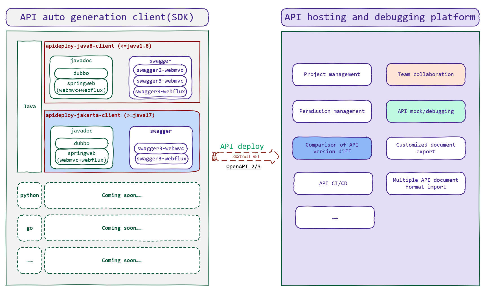

### 背景

当前，在很多中、小型的开发团队或创业团队中，依然用着落后的方式进行着API接口的交互，他们写完文档来写代码，或者，写完代码来补文档，更甚者，文档全靠一张嘴，接口描述信息在IM中沟通飞扬，在联调的过程中前后端相互扯皮、苦不堪言。

作者基于自己多年的研发经验和在创业团队亲身经历，参考了国内外多个API管理工具和实现，始终觉得一款精美、高效的API平台工具，对开发者的意义重大。在苦苦找寻与对比下，各API管理工具依旧没有达到作者的期望，于是亲自下场，一怒之下写下了Apideploy。

Ad.：关于作者更多的路发冲冠之作，可以关注作者主页：https://www.kalman03.com

### 设计理念

Apideploy遵从以下设计理念：

- **代码即文档。**API文档应该通过代码自动生成，并能保持与代码的同步性，而不是通过手写文档来与前端、测试等进行协作；
- **主流标准友好。**文档应该支持主流的OpenAPI 2（OAS2.0）、OpenAPI 3（OAS3.0）等协议标准，同时需要支持HTTP、WebSocket、SSE等协议；
- **版本可追溯。**每一次的版本迭代，可以快速查阅接口变更的明细，支持不同版本的差异对比，并能支持回滚文档版本；
- **接口可mock。**可以直接在该产品上完成接口的测试、联调甚至接口自动化；
- **界面要精美。**友好的用户界面与交互；
- **第三方兼容。**支持导入常见的API协议标准文档，也支持导出常用的文档格式。

### 产品架构

Apideploy核心分为两部分：**API文档生成SDK+API托管与调试平台**。

**API文档生成SDK**是完全开放源码的，访问https://github.com/apideploy-team 可以查阅。目前仅支持Java语言实现，其他语言社区用户可以贡献，或自行直接通过**API托管与调试平台**的RESTFull API进行对接。Java语言SDK实现基于javadoc注释方式自动生成API文档（无代码侵入方式），也兼容了基于swagger的实现。具体使用请参考：

**API托管与调试平台**主要功能包括：项目管理、团队协作、权限管理、API文档托管、文档调试、接口数据mock、版本更新记录、版本对比、个性化文档导出、多格式文档导入等，是一个集API全生命周期管理的平台，非常适合团队协作。目前**支持公有云与私有化部署**，www.apideploy.com是公有云的解决方案。
